# 🏗️ Arquitectura Azure C4 - Sistema Agentes IA Seguros Sura

## 📋 Introducción al Modelo C4

Este documento presenta la arquitectura del sistema en Azure Cloud usando el **modelo C4 (Context, Container, Component, Code)**, proporcionando vistas desde nivel empresarial hasta implementación técnica detallada.

---

## 🌍 Nivel 1: Diagrama de Contexto (Context)

### Vista de Alto Nivel del Sistema

```mermaid
C4Context
    title Sistema de Agentes IA - Seguros Sura Colombia

    Person(cliente, "Cliente Final", "Persona interesada en seguros de autos")
    Person(asesor, "Asesor Humano", "Representante de ventas Seguros Sura")
    Person(admin, "Administrador", "Gestiona configuración del sistema")

    System(suraai, "Sistema Agentes IA", "Asistente conversacional multiagéntico para asesoría y venta de pólizas de autos")

    System_Ext(azureopenai, "Azure OpenAI", "GPT-4o + Embeddings + Vision API")
    System_Ext(suracore, "Core Seguros Sura", "Sistemas principales de la aseguradora")
    System_Ext(fasecolda, "FASECOLDA", "Regulación seguros Colombia")
    System_Ext(simit, "SIMIT", "Consulta multas y sanciones")

    Rel(cliente, suraai, "Consulta seguros, solicita cotizaciones", "HTTPS")
    Rel(asesor, suraai, "Gestiona casos escalados", "HTTPS")
    Rel(admin, suraai, "Configura sistema", "HTTPS")

    Rel(suraai, azureopenai, "Consultas LLM, análisis imágenes", "HTTPS/REST")
    Rel(suraai, suracore, "Expedición pólizas, validaciones", "HTTPS/REST")
    Rel(suraai, fasecolda, "Consulta regulaciones", "HTTPS")
    Rel(suraai, simit, "Verifica antecedentes", "HTTPS")

    UpdateLayoutConfig($c4ShapeInRow="3", $c4BoundaryInRow="1")
```



### Actores y Sistemas Externos

- **👤 Cliente Final:** Usuarios que buscan información y cotizaciones de seguros
- **👨‍💼 Asesor Humano:** Personal de Seguros Sura que gestiona casos complejos
- **⚙️ Administrador:** Equipo técnico que mantiene y configura el sistema
- **🤖 Azure OpenAI:** Proveedor de servicios de IA (GPT-4o, embeddings, vision)
- **🏢 Core Seguros Sura:** Sistemas internos existentes de la aseguradora
- **📊 FASECOLDA:** Federación de Aseguradoras Colombianas
- **🚗 SIMIT:** Sistema de consulta de multas e infracciones

---

## 📦 Nivel 2: Diagrama de Contenedores (Container)

### Arquitectura de Componentes en Azure


### Especificaciones de Contenedores

| Contenedor | Tecnología | Escalabilidad | Recursos |
|------------|------------|---------------|----------|
| **Cliente App** | Streamlit + Python | 2-10 réplicas | 1 vCPU, 2GB RAM |
| **Asesor App** | Streamlit + Python | 1-5 réplicas | 1 vCPU, 2GB RAM |
| **Orchestrator** | LangGraph + Python | 2-20 réplicas | 2 vCPU, 4GB RAM |
| **RAG Service** | ChromaDB + Python | 1-5 réplicas | 2 vCPU, 8GB RAM |
| **Expedition API** | Flask + Python | 2-10 réplicas | 1 vCPU, 2GB RAM |

---

## 🔧 Nivel 3: Diagrama de Componentes (Component)

### Vista Detallada del Orchestrator Service

```mermaid
C4Component
    title Componentes del Orchestrator Service

    Container(webapp, "Web Applications", "Streamlit", "Interfaces usuario")
    Container(cosmosdb, "Cosmos DB", "NoSQL", "Estado persistente")
    Container(azureopenai, "Azure OpenAI", "LLM", "Servicios IA")
    
    Container_Boundary(orchestrator, "Orchestrator Service") {
        Component(router, "Request Router", "FastAPI", "Enrutado de peticiones HTTP")
        Component(statemgr, "State Manager", "Python", "Gestión estado conversacional")
        
        Component_Boundary(agents, "Agent Layer") {
            Component(consultant, "Consultant Agent", "LangChain", "Consultas RAG")
            Component(quotation, "Quotation Agent", "LangChain", "Cotizaciones + Vision")
            Component(expedition, "Expedition Agent", "LangChain", "Expedición pólizas")
            Component(humanloop, "Human Loop Agent", "LangChain", "Escalamiento")
        }
        
        Component_Boundary(services, "Service Layer") {
            Component(ragservice, "RAG Service", "ChromaDB", "Búsqueda semántica")
            Component(visionservice, "Vision Service", "OpenAI Vision", "Análisis imágenes")
            Component(quotecalc, "Quote Calculator", "Python", "Cálculo primas")
            Component(validation, "Data Validator", "Python", "Validación datos")
        }
        
        Component_Boundary(integrations, "Integration Layer") {
            Component(oaiclient, "OpenAI Client", "Azure SDK", "Cliente Azure OpenAI")
            Component(dbclient, "Database Client", "Azure SDK", "Cliente Cosmos DB")
            Component(storageclient, "Storage Client", "Azure SDK", "Cliente Blob Storage")
        }
    }

    Rel(webapp, router, "HTTP Requests", "REST")
    Rel(router, statemgr, "Route requests", "Internal")
    
    Rel(statemgr, consultant, "Consultation", "Internal")
    Rel(statemgr, quotation, "Quote request", "Internal")
    Rel(statemgr, expedition, "Expedition", "Internal")
    Rel(statemgr, humanloop, "Escalation", "Internal")
    
    Rel(consultant, ragservice, "Search docs", "Internal")
    Rel(quotation, visionservice, "Analyze image", "Internal")
    Rel(quotation, quotecalc, "Calculate", "Internal")
    Rel(expedition, validation, "Validate data", "Internal")
    
    Rel(ragservice, oaiclient, "Embeddings", "HTTPS")
    Rel(visionservice, oaiclient, "Vision API", "HTTPS")
    Rel(statemgr, dbclient, "State persistence", "HTTPS")
    Rel(ragservice, storageclient, "Read documents", "HTTPS")
    
    Rel(oaiclient, azureopenai, "API calls", "HTTPS")
    Rel(dbclient, cosmosdb, "Data ops", "HTTPS")

    UpdateLayoutConfig($c4ShapeInRow="3", $c4BoundaryInRow="1")
```

---

## 🚀 Nivel 4: Infraestructura como Código (IaC)

### Bicep Template para Azure Deployment

```bicep
// main.bicep - Infrastructure as Code
@description('Región de Azure para despliegue')
param location string = resourceGroup().location

@description('Nombre del ambiente (dev, staging, prod)')
param environment string = 'dev'

@description('Prefijo para nombres de recursos')
param resourcePrefix string = 'suraai'

// Variables
var uniqueSuffix = substring(uniqueString(resourceGroup().id), 0, 6)
var commonName = '${resourcePrefix}-${environment}-${uniqueSuffix}'

// ===========================================
// CONTAINER APPS ENVIRONMENT
// ===========================================
resource containerAppsEnvironment 'Microsoft.App/managedEnvironments@2023-05-01' = {
  name: '${commonName}-cae'
  location: location
  properties: {
    daprAIInstrumentationKey: applicationInsights.properties.InstrumentationKey
    appLogsConfiguration: {
      destination: 'log-analytics'
      logAnalyticsConfiguration: {
        customerId: logAnalyticsWorkspace.properties.customerId
        sharedKey: logAnalyticsWorkspace.listKeys().primarySharedKey
      }
    }
  }
}

// ===========================================
// CONTAINER APPS
// ===========================================

// Cliente Interface
resource clientApp 'Microsoft.App/containerApps@2023-05-01' = {
  name: '${commonName}-client'
  location: location
  properties: {
    managedEnvironmentId: containerAppsEnvironment.id
    configuration: {
      secrets: [
        {
          name: 'openai-api-key'
          keyVaultUrl: '${keyVault.properties.vaultUri}secrets/openai-api-key'
          identity: userAssignedIdentity.id
        }
      ]
      ingress: {
        external: true
        targetPort: 8501
        allowInsecure: false
      }
    }
    template: {
      containers: [
        {
          image: 'suraai/client-interface:latest'
          name: 'client-interface'
          env: [
            {
              name: 'STREAMLIT_SERVER_PORT'
              value: '8501'
            }
            {
              name: 'ORCHESTRATOR_URL'
              value: 'https://${orchestratorApp.properties.configuration.ingress.fqdn}'
            }
            {
              name: 'AZURE_OPENAI_API_KEY'
              secretRef: 'openai-api-key'
            }
          ]
          resources: {
            cpu: json('1.0')
            memory: '2Gi'
          }
        }
      ]
      scale: {
        minReplicas: 2
        maxReplicas: 10
        rules: [
          {
            name: 'http-requests'
            http: {
              metadata: {
                concurrentRequests: '100'
              }
            }
          }
        ]
      }
    }
  }
}

// Asesor Interface
resource advisorApp 'Microsoft.App/containerApps@2023-05-01' = {
  name: '${commonName}-advisor'
  location: location
  properties: {
    managedEnvironmentId: containerAppsEnvironment.id
    configuration: {
      secrets: [
        {
          name: 'openai-api-key'
          keyVaultUrl: '${keyVault.properties.vaultUri}secrets/openai-api-key'
          identity: userAssignedIdentity.id
        }
      ]
      ingress: {
        external: true
        targetPort: 8502
        allowInsecure: false
      }
    }
    template: {
      containers: [
        {
          image: 'suraai/advisor-interface:latest'
          name: 'advisor-interface'
          env: [
            {
              name: 'STREAMLIT_SERVER_PORT'
              value: '8502'
            }
            {
              name: 'ORCHESTRATOR_URL'
              value: 'https://${orchestratorApp.properties.configuration.ingress.fqdn}'
            }
          ]
          resources: {
            cpu: json('1.0')
            memory: '2Gi'
          }
        }
      ]
      scale: {
        minReplicas: 1
        maxReplicas: 5
      }
    }
  }
}

// Orchestrator Service
resource orchestratorApp 'Microsoft.App/containerApps@2023-05-01' = {
  name: '${commonName}-orchestrator'
  location: location
  properties: {
    managedEnvironmentId: containerAppsEnvironment.id
    configuration: {
      secrets: [
        {
          name: 'openai-api-key'
          keyVaultUrl: '${keyVault.properties.vaultUri}secrets/openai-api-key'
          identity: userAssignedIdentity.id
        }
        {
          name: 'cosmos-connection-string'
          keyVaultUrl: '${keyVault.properties.vaultUri}secrets/cosmos-connection-string'
          identity: userAssignedIdentity.id
        }
      ]
      ingress: {
        external: true
        targetPort: 8000
        allowInsecure: false
      }
    }
    template: {
      containers: [
        {
          image: 'suraai/orchestrator:latest'
          name: 'orchestrator'
          env: [
            {
              name: 'AZURE_OPENAI_API_KEY'
              secretRef: 'openai-api-key'
            }
            {
              name: 'COSMOS_CONNECTION_STRING'
              secretRef: 'cosmos-connection-string'
            }
            {
              name: 'STORAGE_ACCOUNT_URL'
              value: storageAccount.properties.primaryEndpoints.blob
            }
          ]
          resources: {
            cpu: json('2.0')
            memory: '4Gi'
          }
        }
      ]
      scale: {
        minReplicas: 2
        maxReplicas: 20
        rules: [
          {
            name: 'http-requests'
            http: {
              metadata: {
                concurrentRequests: '50'
              }
            }
          }
          {
            name: 'cpu-usage'
            custom: {
              type: 'cpu'
              metadata: {
                type: 'Utilization'
                value: '70'
              }
            }
          }
        ]
      }
    }
  }
}

// ===========================================
// DATA SERVICES
// ===========================================

// Cosmos DB
resource cosmosAccount 'Microsoft.DocumentDB/databaseAccounts@2023-04-15' = {
  name: '${commonName}-cosmos'
  location: location
  kind: 'GlobalDocumentDB'
  properties: {
    consistencyPolicy: {
      defaultConsistencyLevel: 'Session'
    }
    locations: [
      {
        locationName: location
        failoverPriority: 0
        isZoneRedundant: false
      }
    ]
    databaseAccountOfferType: 'Standard'
    enableAutomaticFailover: false
    enableMultipleWriteLocations: false
    capabilities: [
      {
        name: 'EnableServerless'
      }
    ]
  }
}

resource cosmosDatabase 'Microsoft.DocumentDB/databaseAccounts/sqlDatabases@2023-04-15' = {
  parent: cosmosAccount
  name: 'suraai'
  properties: {
    resource: {
      id: 'suraai'
    }
  }
}

resource conversationsContainer 'Microsoft.DocumentDB/databaseAccounts/sqlDatabases/containers@2023-04-15' = {
  parent: cosmosDatabase
  name: 'conversations'
  properties: {
    resource: {
      id: 'conversations'
      partitionKey: {
        paths: [
          '/session_id'
        ]
        kind: 'Hash'
      }
      indexingPolicy: {
        indexingMode: 'consistent'
        automatic: true
        includedPaths: [
          {
            path: '/*'
          }
        ]
      }
    }
  }
}

// Storage Account
resource storageAccount 'Microsoft.Storage/storageAccounts@2023-01-01' = {
  name: replace('${commonName}storage', '-', '')
  location: location
  sku: {
    name: 'Standard_LRS'
  }
  kind: 'StorageV2'
  properties: {
    accessTier: 'Hot'
    allowBlobPublicAccess: false
    minimumTlsVersion: 'TLS1_2'
  }
}

resource documentsContainer 'Microsoft.Storage/storageAccounts/blobServices/containers@2023-01-01' = {
  name: '${storageAccount.name}/default/documents'
  properties: {
    publicAccess: 'None'
  }
}

resource imagesContainer 'Microsoft.Storage/storageAccounts/blobServices/containers@2023-01-01' = {
  name: '${storageAccount.name}/default/images'
  properties: {
    publicAccess: 'None'
  }
}

// ===========================================
// SECURITY & IDENTITY
// ===========================================

// Key Vault
resource keyVault 'Microsoft.KeyVault/vaults@2023-02-01' = {
  name: '${commonName}-kv'
  location: location
  properties: {
    sku: {
      family: 'A'
      name: 'standard'
    }
    tenantId: subscription().tenantId
    accessPolicies: []
    enableRbacAuthorization: true
    enableSoftDelete: true
    softDeleteRetentionInDays: 7
    enablePurgeProtection: false
  }
}

// Managed Identity
resource userAssignedIdentity 'Microsoft.ManagedIdentity/userAssignedIdentities@2023-01-31' = {
  name: '${commonName}-identity'
  location: location
}

// ===========================================
// MONITORING & OBSERVABILITY
// ===========================================

// Log Analytics
resource logAnalyticsWorkspace 'Microsoft.OperationalInsights/workspaces@2022-10-01' = {
  name: '${commonName}-logs'
  location: location
  properties: {
    sku: {
      name: 'PerGB2018'
    }
    retentionInDays: 30
  }
}

// Application Insights
resource applicationInsights 'Microsoft.Insights/components@2020-02-02' = {
  name: '${commonName}-insights'
  location: location
  kind: 'web'
  properties: {
    Application_Type: 'web'
    WorkspaceResourceId: logAnalyticsWorkspace.id
  }
}

// ===========================================
// OUTPUTS
// ===========================================
output clientAppUrl string = 'https://${clientApp.properties.configuration.ingress.fqdn}'
output advisorAppUrl string = 'https://${advisorApp.properties.configuration.ingress.fqdn}'
output orchestratorUrl string = 'https://${orchestratorApp.properties.configuration.ingress.fqdn}'
```

---

## 🔒 Seguridad y Compliance

### Implementación de Zero Trust

```mermaid
C4Container
    title Arquitectura de Seguridad Zero Trust

    Person(user, "Usuario", "Cliente/Asesor")
    
    Container_Boundary(edge, "Edge Security") {
        Container(waf, "Azure WAF", "Web Application Firewall", "Protección aplicación web")
        Container(frontdoor, "Azure Front Door", "CDN + Security", "Distribución global + DDoS")
    }
    
    Container_Boundary(identity, "Identity & Access") {
        Container(adb2c, "Azure AD B2C", "Identity Provider", "Autenticación usuarios")
        Container(rbac, "Azure RBAC", "Authorization", "Control acceso basado en roles")
    }
    
    Container_Boundary(network, "Network Security") {
        Container(vnet, "Virtual Network", "Private Network", "Red privada Azure")
        Container(nsg, "Network Security Groups", "Firewall", "Reglas tráfico de red")
        Container(privatelink, "Private Link", "Private Connectivity", "Conexiones privadas servicios")
    }
    
    Container_Boundary(data, "Data Protection") {
        Container(encryption, "Azure Disk Encryption", "Encryption", "Cifrado datos en reposo")
        Container(keyvault, "Azure Key Vault", "Secrets Management", "Gestión certificados/secretos")
        Container(purview, "Microsoft Purview", "Data Governance", "Clasificación y protección datos")
    }
    
    Container_Boundary(monitoring, "Security Monitoring") {
        Container(sentinel, "Azure Sentinel", "SIEM", "Detección amenazas")
        Container(defender, "Microsoft Defender", "Security Center", "Protección workloads")
    }

    Rel(user, frontdoor, "HTTPS", "443")
    Rel(frontdoor, waf, "Filtered traffic", "443")
    Rel(waf, adb2c, "Authentication", "443")
    Rel(adb2c, rbac, "Authorization", "Internal")
    
    Rel(rbac, vnet, "Authorized access", "Private")
    Rel(vnet, privatelink, "Private connectivity", "Private")
    
    Rel_Back(keyvault, encryption, "Keys/Secrets", "Private")
    Rel(purview, data, "Data classification", "Private")
    
    Rel(sentinel, monitoring, "Security events", "Private")
    Rel(defender, monitoring, "Threat detection", "Private")

    UpdateLayoutConfig($c4ShapeInRow="2", $c4BoundaryInRow="2")
```

### Políticas de Seguridad

| Componente | Política | Implementación |
|------------|----------|----------------|
| **🔐 Autenticación** | Multi-factor obligatorio | Azure AD B2C + Conditional Access |
| **🛡️ Autorización** | Least Privilege | Azure RBAC granular |
| **🔒 Cifrado** | Datos en tránsito y reposo | TLS 1.3 + Azure Disk Encryption |
| **🌐 Red** | Zero Trust Network | Private Link + NSG |
| **📊 Monitoreo** | SOC 24/7 | Azure Sentinel + Defender |
| **📋 Compliance** | GDPR + PCI DSS | Microsoft Purview |

---

## 📈 Escalabilidad y Performance

### Auto-scaling Policies

```yaml
# Container Apps Scaling Rules
scaling:
  minReplicas: 2
  maxReplicas: 50
  rules:
    - name: "cpu-scaling"
      type: "cpu"
      metadata:
        type: "Utilization"
        value: "70"
    
    - name: "memory-scaling"
      type: "memory"
      metadata:
        type: "Utilization" 
        value: "80"
    
    - name: "http-scaling"
      type: "http"
      metadata:
        concurrentRequests: "100"
    
    - name: "custom-scaling"
      type: "azure-servicebus"
      metadata:
        queueName: "orchestrator-queue"
        messageCount: "5"
```

### Performance Targets

| Métrica | Target | Monitoring |
|---------|--------|------------|
| **⚡ Response Time** | < 2s (95th percentile) | Application Insights |
| **🚀 Throughput** | 1000 req/min/replica | Azure Monitor |
| **📊 Availability** | 99.9% SLA | Service Health |
| **💾 Memory Usage** | < 80% utilization | Container Insights |
| **⚙️ CPU Usage** | < 70% utilization | Azure Metrics |

---

## 💰 Estimación de Costos Azure

### Costos Mensuales Estimados (Ambiente Producción)

| Servicio | SKU | Cantidad | Costo Mensual |
|----------|-----|----------|---------------|
| **Azure Container Apps** | Consumption | 10 instancias promedio | $150 |
| **Azure Cosmos DB** | Serverless | 1M operaciones | $25 |
| **Azure Storage** | Standard LRS | 100GB | $2 |
| **Azure Key Vault** | Standard | 1 instancia | $3 |
| **Log Analytics** | Pay-as-you-go | 5GB/mes | $10 |
| **Application Insights** | Basic | Telemetría estándar | $15 |
| **Azure OpenAI** | Pay-per-use | 1M tokens/mes | $20 |
| **Azure Front Door** | Standard | 1TB transferencia | $35 |
| **Network** | Bandwidth | 1TB salida | $90 |
| **Backup & Disaster Recovery** | GRS | 100GB | $5 |

**💰 Total Estimado: ~$355 USD/mes**

### Optimizaciones de Costo

- **💡 Dev/Staging:** Usar Azure Container Instances (~70% ahorro)
- **📊 Reserved Instances:** 40% descuento para cargas predecibles
- **🌙 Auto-shutdown:** Environments no-productivos fuera de horario
- **📈 Spot Instances:** Para testing y desarrollo

---

## 🚀 Pipeline CI/CD

### Azure DevOps Pipeline

```yaml
# azure-pipelines.yml
trigger:
  branches:
    include:
      - main
      - develop

variables:
  - group: suraai-variables
  - name: imageRepository
    value: 'suraai'
  - name: containerRegistry
    value: 'suraairegistry.azurecr.io'

stages:
- stage: Build
  displayName: Build and Test
  jobs:
  - job: Build
    displayName: Build
    pool:
      vmImage: ubuntu-latest
    steps:
    - task: UsePythonVersion@0
      inputs:
        versionSpec: '3.11'
        addToPath: true

    - script: |
        python -m pip install --upgrade pip
        pip install -r requirements/local.txt
      displayName: 'Install dependencies'

    - script: |
        python -m pytest tests/ --junitxml=junit/test-results.xml --cov=.
      displayName: 'Run tests'

    - task: PublishTestResults@2
      inputs:
        testResultsFiles: 'junit/test-results.xml'

- stage: Deploy
  displayName: Deploy to Azure
  dependsOn: Build
  condition: and(succeeded(), eq(variables['Build.SourceBranch'], 'refs/heads/main'))
  jobs:
  - deployment: Deploy
    displayName: Deploy
    environment: 'production'
    pool:
      vmImage: ubuntu-latest
    strategy:
      runOnce:
        deploy:
          steps:
          - task: AzureCLI@2
            displayName: 'Deploy Infrastructure'
            inputs:
              azureSubscription: 'azure-service-connection'
              scriptType: 'bash'
              scriptLocation: 'inlineScript'
              inlineScript: |
                az deployment group create \
                  --resource-group $(resourceGroupName) \
                  --template-file infrastructure/main.bicep \
                  --parameters environment=prod
```

---

## 📊 Monitoreo y Observabilidad

### Dashboards de Monitoreo

```json
{
  "dashboardConfig": {
    "widgets": [
      {
        "title": "Request Rate",
        "type": "metric",
        "query": "requests/rate(5m)",
        "target": "< 1000 req/min"
      },
      {
        "title": "Response Time P95", 
        "type": "metric",
        "query": "http_request_duration_p95",
        "target": "< 2000ms"
      },
      {
        "title": "Error Rate",
        "type": "metric", 
        "query": "errors/total * 100",
        "target": "< 1%"
      },
      {
        "title": "Agent Performance",
        "type": "table",
        "columns": [
          "agent_name",
          "avg_response_time", 
          "success_rate",
          "escalation_rate"
        ]
      }
    ],
    "alerts": [
      {
        "name": "High Error Rate",
        "condition": "error_rate > 5%",
        "action": "email + teams"
      },
      {
        "name": "High Response Time",
        "condition": "response_time_p95 > 3000ms", 
        "action": "auto-scale + notification"
      }
    ]
  }
}
```

---

## 🎯 Conclusiones

### ✅ Beneficios de la Arquitectura Azure

1. **🚀 Escalabilidad Automática:** Container Apps con auto-scaling inteligente
2. **🔒 Seguridad Enterprise:** Zero Trust con múltiples capas de protección
3. **📊 Observabilidad Completa:** Monitoreo 360° con Application Insights
4. **💰 Optimización de Costos:** Pay-per-use con optimizaciones automáticas
5. **🔄 DevOps Integrado:** CI/CD nativo con Azure DevOps
6. **🌍 Disponibilidad Global:** Multi-región con failover automático

### 📈 KPIs de Producción

- **Availability:** 99.9% SLA garantizado
- **Performance:** < 2s response time (P95)
- **Scalability:** 0 a 1000 usuarios en < 30s
- **Security:** SOC 2 Type II compliance
- **Cost:** ~$355/mes para 1000 usuarios activos

### 🔮 Roadmap de Evolución

1. **Q1 2025:** Implementación base en Azure
2. **Q2 2025:** Multi-región + HA + DR
3. **Q3 2025:** ML/AI avanzado + Analytics
4. **Q4 2025:** Edge computing + Mobile apps

---

*🏗️ Esta arquitectura C4 proporciona una base sólida y escalable para el despliegue empresarial del sistema en Azure Cloud*  
*✅ Cumple estándares de seguridad, performance y costos para Seguros Sura Colombia*
